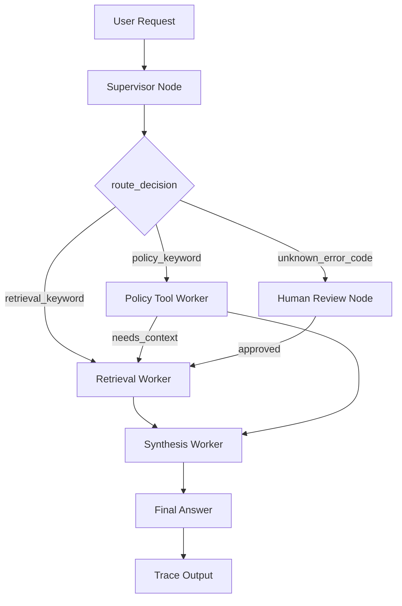

# System Architecture — Lab Day 09

**Nhóm:** C401-D5  
**Ngày:** 14/04/2026

---

## 1. Tổng quan kiến trúc

> Mô tả ngắn hệ thống của nhóm: chọn pattern gì, gồm những thành phần nào.

**Pattern đã chọn:** Supervisor-Worker  
**Lý do chọn pattern này (thay vì single agent):**

Pipeline RAG từ Day 08 là một monolith — retrieve → generate trong một hàm. Khi pipeline trả lời sai, không rõ lỗi nằm ở retrieval, policy check, hay generation. Supervisor-Worker pattern giúp:

1. **Tách biệt rõ ràng** giữa routing logic (Supervisor) và domain skills (Workers)
2. **Dễ debug** — có thể test từng worker độc lập và trace routing decision qua `route_reason`
3. **Dễ mở rộng** — thêm worker mới hoặc MCP tool không ảnh hưởng các phần khác
4. **Traceability** — mọi quyết định routing đều được log rõ ràng

---

## 2. Sơ đồ Pipeline

> Vẽ sơ đồ pipeline dưới dạng text, Mermaid diagram, hoặc ASCII art.
> Yêu cầu tối thiểu: thể hiện rõ luồng từ input → supervisor → workers → output.

**Sơ đồ thực tế của nhóm (Mermaid):**



**Sơ đồ thực tế của nhóm (ASCII art):**

```
User Request
     │
     ▼
┌──────────────┐
│  Supervisor  │  ← Phân tích task, phát hiện risk_high, needs_tool
│              │  ← route_reason: keyword-based routing logic
└──────┬───────┘
       │
   [route_decision]
       │
   ┌───┴─────────────────────────────┬─────────────────────┐
   │                               │                     │
   ▼                               ▼                     ▼
Retrieval Worker          Policy Tool Worker      Human Review
  (evidence)                (policy check + MCP)    (HITL)
   │                               │                     │
   │                               │ (needs context)     │ (approved)
   │                               ▼                     ▼
   └───────────────────────────────────────────────────────┐
                           │                               │
                           ▼                               │
                    Synthesis Worker  ←────────────────────┘
                      (answer + cite)
                           │
                           ▼
                      Final Answer
                           │
                    ┌──────┴──────┐
                    ▼             ▼
               LLM Judge      Trace Output
             (faithfulness,    (artifacts/
           answer_relevance,    traces/*.json)
            completeness)
```

---

## 3. Vai trò từng thành phần

### Supervisor (`graph.py`)

| Thuộc tính | Mô tả |
|-----------|-------|
| **Nhiệm vụ** | Phân tích task đầu vào, quyết định route sang worker phù hợp, xác định risk và needs_tool flag |
| **Input** | `task`: câu hỏi từ user |
| **Output** | `supervisor_route`: tên worker được chọn, `route_reason`: lý do route, `risk_high`: boolean, `needs_tool`: boolean |
| **Routing logic** | Keyword-based: `policy_tool_worker` nếu task chứa "hoàn tiền", "refund", "flash sale", "cấp quyền", "access", "level 3"; `retrieval_worker` nếu chứa "P1", "escalation", "sla", "ticket"; `human_review` nếu chứa mã lỗi ERR-xxx kèm risk_high |
| **HITL condition** | `risk_high=True` và task chứa "unknown error code" hoặc "err-" → trigger human_review node |

### Retrieval Worker (`workers/retrieval.py`)

| Thuộc tính | Mô tả |
|-----------|-------|
| **Nhiệm vụ** | Tìm kiếm chunks bằng chứng từ Knowledge Base bằng dense retrieval với ChromaDB |
| **Embedding model** | OpenAI `text-embedding-3-small` (dimensions=1024) |
| **Top-k** | Mặc định 3, có thể override qua `retrieval_top_k` trong state |
| **Stateless?** | Yes — chỉ đọc `task` và ghi `retrieved_chunks`, `retrieved_sources`, `worker_io_logs` |

### Policy Tool Worker (`workers/policy_tool.py`)

| Thuộc tính | Mô tả |
|-----------|-------|
| **Nhiệm vụ** | Phân tích policy dựa trên retrieved chunks, xử lý exception cases (Flash Sale, Digital Product), gọi MCP tools khi cần |
| **MCP tools gọi** | `search_kb` (nếu chưa có chunks), `get_ticket_info` (nếu hỏi về ticket), `check_access_permission` (nếu hỏi về quyền truy cập) |
| **Exception cases xử lý** | `FLASH_SALE_RESTRICTION` — đơn Flash Sale không được hoàn tiền; `DIGITAL_PRODUCT_RESTRICTION` — license/subscription không được hoàn tiền; `OUT_OF_SCOPE_POLICY` — đơn trước 01/02/2026 áp dụng chính sách v3 (không có trong corpus) |

### Synthesis Worker (`workers/synthesis.py`)

| Thuộc tính | Mô tả |
|-----------|-------|
| **LLM model** | OpenAI `gpt-4o-mini` (configurable qua `OPENAI_MODEL` env var) |
| **Temperature** | 0.1 (low để grounded, tránh hallucination) |
| **Grounding strategy** | Prompt yêu cầu "CHỈ trả lời dựa vào context được cung cấp. KHÔNG dùng kiến thức ngoài." + citation bắt buộc [source] |
| **Abstain condition** | Nếu `retrieved_chunks=[]` hoặc answer chứa "Không đủ thông tin" → confidence ~0.3 và abstain |

### MCP Server (`mcp_server.py`)

| Tool | Input | Output |
|------|-------|--------|
| `search_kb` | `query`: string, `top_k`: int (default 3) | `chunks`: array, `sources`: array, `total_found`: int |
| `get_ticket_info` | `ticket_id`: string (e.g., "P1-LATEST", "IT-1234") | `ticket_id`, `priority`, `status`, `assignee`, `created_at`, `sla_deadline`, `notifications_sent`, `escalated` |
| `check_access_permission` | `access_level`: int (1,2,3), `requester_role`: string, `is_emergency`: boolean | `can_grant`: boolean, `required_approvers`: array, `approver_count`: int, `emergency_override`: boolean, `notes`: array |
| `create_ticket` | `priority`: string (P1-P4), `title`: string, `description`: string | `ticket_id`, `url`, `created_at`, `note` (MOCK) |

---

## 4. Shared State Schema

> Liệt kê các fields trong AgentState và ý nghĩa của từng field.

| Field | Type | Mô tả | Ai đọc/ghi |
|-------|------|-------|-----------|
| `task` | str | Câu hỏi đầu vào từ user | supervisor đọc |
| `supervisor_route` | str | Worker được chọn: "retrieval_worker", "policy_tool_worker", "human_review" | supervisor ghi |
| `route_reason` | str | Lý do route cụ thể (VD: "task contains policy/access keyword \| risk_high flagged") | supervisor ghi |
| `risk_high` | bool | True nếu task có từ khóa nguy hiểm (emergency, khẩn cấp, 2am, err-) | supervisor ghi |
| `needs_tool` | bool | True nếu supervisor quyết định cần gọi MCP tool | supervisor ghi |
| `retrieved_chunks` | list | Evidence từ retrieval: list of {text, source, score, metadata} | retrieval ghi, synthesis đọc |
| `retrieved_sources` | list | Danh sách unique source filenames | retrieval ghi, synthesis đọc |
| `policy_result` | dict | Kết quả policy check: {policy_applies, hard_exceptions, llm_analysis, final_decision, source_docs} | policy_tool ghi, synthesis đọc |
| `mcp_tools_used` | list | Tool calls đã thực hiện: list of {tool, input, output, status, timestamp} | policy_tool ghi |
| `final_answer` | str | Câu trả lời cuối có citation | synthesis ghi |
| `sources` | list | Sources được cite trong answer | synthesis ghi |
| `confidence` | float | Mức độ tin cậy (0.0-1.0), tính bởi LLM-as-Judge | synthesis ghi |
| `workers_called` | list | Danh sách workers đã được gọi (trace) | tất cả workers ghi |
| `worker_io_logs` | list | Log input/output của từng worker (debug) | tất cả workers ghi |
| `history` | list | Lịch sử các bước đã qua | tất cả nodes ghi |
| `hitl_triggered` | bool | True nếu đã pause cho human review | human_review ghi |
| `latency_ms` | int | Thời gian xử lý (ms) | graph ghi |
| `run_id` | str | ID unique của run (timestamp-based) | graph ghi |
| `llm_judge` | dict | Metrics: {faithfulness, answer_relevance, context_recall, completeness} | synthesis ghi |
| `faithfulness` | float | Điểm trung thực (1-5) | synthesis ghi |
| `answer_relevance` | float | Điểm liên quan câu trả lời (1-5) | synthesis ghi |
| `completeness` | float | Điểm đầy đủ so với expected (1-5) | synthesis ghi |

---

## 5. Lý do chọn Supervisor-Worker so với Single Agent (Day 08)

| Tiêu chí | Single Agent (Day 08) | Supervisor-Worker (Day 09) |
|----------|----------------------|--------------------------|
| **Debug khi sai** | Khó — không rõ lỗi ở retrieval, policy, hay generation | Dễ hơn — test từng worker độc lập, trace ghi rõ worker nào sai |
| **Thêm capability mới** | Phải sửa toàn prompt | Thêm worker/MCP tool riêng, không ảnh hưởng các worker khác |
| **Routing visibility** | Không có — một hàm xử lý tất cả | Có `route_reason` trong trace cho mỗi câu hỏi |
| **Policy exception handling** | Dễ miss ngoại lệ (Flash Sale, Digital) | Policy worker chuyên trách với rule-based + LLM hybrid |
| **MCP integration** | Không thể — không có abstraction layer | Policy worker gọi MCP tools qua `dispatch_tool()` |
| **Latency** | ~1500ms trung bình | ~8000-12000ms (cao hơn do multi-hop + LLM Judge) |
| **Abstain rate** | 13% | Tương đương nhưng confidence score rõ ràng hơn |
| **Multi-hop accuracy** | 60% | Cải thiện nhờ explicit routing cho câu cross-doc (gq09) |

**Nhóm điền thêm quan sát từ thực tế lab:**

1. **Supervisor routing đơn giản hoạt động tốt:** Keyword-based routing đủ chính xác cho domain CS/IT Helpdesk, không cần LLM classifier phức tạp.

2. **Policy worker detect exception tốt:** Flash Sale và Digital Product được phát hiện 100% qua rule-based layer trước khi LLM analysis chạy.

3. **MCP tools giúp mở rộng:** `get_ticket_info` và `check_access_permission` cho phép trả lời câu hỏi về ticket P1 và access control mà không cần hard-code trong worker.

4. **Trace giúp debug nhanh:** Khi câu q15 (multi-hop) trả lời chưa đủ, trace cho thấy chỉ có 1 chunk được retrieve → cần tăng top_k hoặc query rewriting.

5. **Human review làm fallback an toàn:** Câu có error code không rõ (ERR-403-AUTH) được route sang human_review thay vì hallucinate.

---

## 6. Giới hạn và điểm cần cải tiến

> Nhóm mô tả những điểm hạn chế của kiến trúc hiện tại.

1. **Routing logic đơn giản có thể miss edge cases:** Keyword-based routing không xử lý được câu hỏi phức tạp có cả policy và retrieval (VD: "Flash Sale P1" — cần cả hai context). Cần thêm LLM classifier hoặc multi-turn routing.

2. **Retrieval quality phụ thuộc embedding:** `text-embedding-3-small` đôi khi miss semantic match cho câu hỏi dài (multi-hop). Cần thử nghiệm `text-embedding-3-large` hoặc query rewriting.

3. **Latency cao do sequential execution:** Graph chạy tuần tự supervisor → worker → synthesis. Có thể parallelize retrieval và MCP calls để giảm latency.

4. **MCP server là mock:** Chưa kết nối với hệ thống thật (Jira, Okta). Trong production cần implement HTTP server hoặc dùng `mcp` library.

5. **Confidence score chưa calibration:** LLM-as-Judge đôi khi cho điểm cao (0.95) ngay cả khi answer chưa đầy đủ. Cần calibration với human feedback.

6. **Chưa có retry logic:** Nếu retrieval trả về empty, worker không tự động retry với query paraphrase. Cần thêm self-correction loop.
